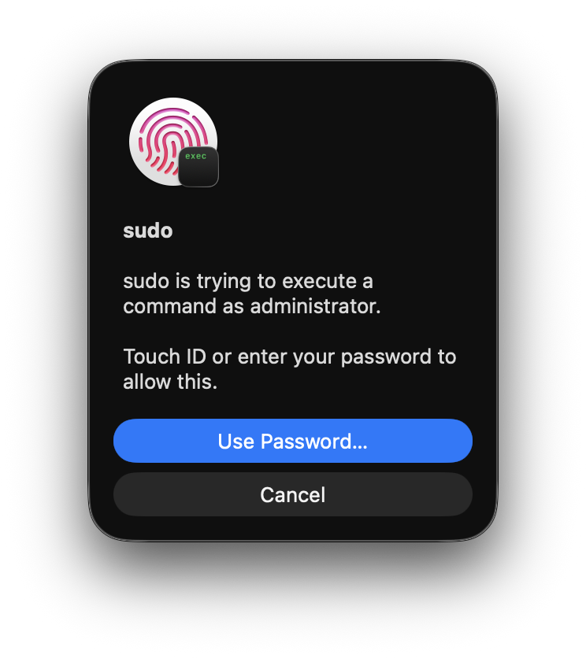
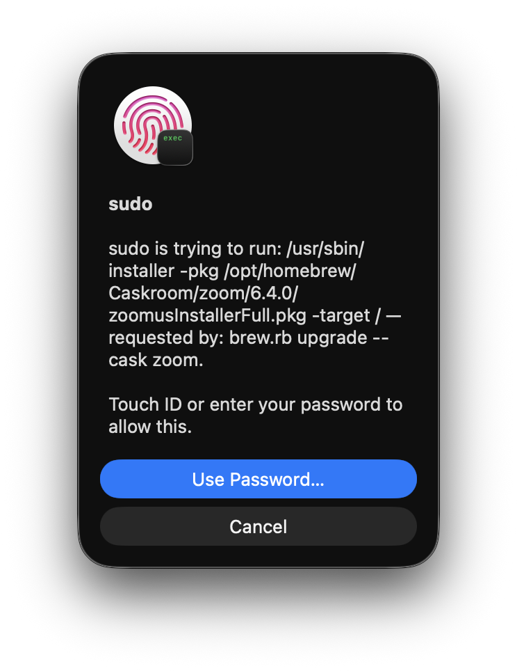

# macos-sudo-touchid-context

A Touch ID PAM module for macOS `sudo` whose dialog says what is being authorized
and which process asked.

Apple's `pam_tid.so` shows the same dialog for every request: "sudo is trying to
execute a command as administrator." When a background job (a `brew upgrade`
installing a cask `.pkg`, a launchd script) triggers it, the dialog gives no way
to tell what you are approving.

<table>
  <tr>
    <th>Apple's <code>pam_tid.so</code></th>
    <th>This module</th>
  </tr>
  <tr>
    <td valign="top"></td>
    <td valign="top"></td>
  </tr>
</table>

Both are captured with `just screenshot`. Apple's dialog comes from real
`/usr/bin/sudo` (it reads the same for every command). This module's runs through
the test harness with the argv and parent process brew gives sudo.

Inline shell wrappers are skipped when naming the requester, so a job started via
`zsh -c '…'` shows as `claude (via zsh -c)` rather than the shell's command line.

## Status

Working on macOS 26.6 (Apple silicon) for sudo: Touch ID approval, and cancel
falling back to the terminal password prompt, are tested. The screenshot uses
brew's process shape; a live cask upgrade has not been observed yet
([#1](https://github.com/laurigates/macos-sudo-touchid-context/issues/1)). Small and young; read
[`docs/how-it-works.md`](docs/how-it-works.md) before installing.

## Requirements

- macOS 14 or later (`/etc/pam.d/sudo_local` exists from macOS 14)
- Xcode Command Line Tools (`clang`), [`just`](https://github.com/casey/just)
- A Mac with Touch ID and at least one enrolled finger

## Install

> **Keep a root shell open in another window (`sudo -s`) until you have tested
> the result.** If `sudo_local` names a module that cannot be loaded, macOS
> refuses every sudo login, whatever the control flag says
> ([details](docs/how-it-works.md#a-module-that-fails-to-load-locks-sudo)).

```
just test        # builds, checks reason formatting, checks libpam accepts the module
just try-dialog  # optional: a real Touch ID dialog from the module, outside sudo
just install     # installs to /usr/local/lib/pam, rewrites /etc/pam.d/sudo_local
just try-sudo    # in a new terminal: sudo -k; sudo /usr/bin/id -un
```

`just install`:

1. Asks libpam whether the built module loads, and stops if it does not.
2. Installs `/usr/local/lib/pam/pam_tid_context.so` (root:wheel, 0444) and asks
   libpam again about the installed copy.
3. Backs up `sudo_local` to `sudo_local.bak-<timestamp>`, comments out active
   `pam_tid.so` lines and puts this module's line in place of the first one
   (after `pam_reattach.so`, if you use it). Re-running is idempotent.
4. Asks libpam whether the new `sudo_local` loads, and restores the backup if not.

The libpam check is `tests/probe_load.c`, which calls the policy parser sudo
itself uses. See [Testing](docs/how-it-works.md#testing).

## Recovery

If sudo prints `sudo: unable to initialize PAM: No such file or directory`, the
module could not be loaded. The message reads the same whatever the actual cause:
a missing file, wrong architecture, or wrong path. From the root shell:

```
cp -p /etc/pam.d/sudo_local.bak-<timestamp> /etc/pam.d/sudo_local
```

Without a root shell, `osascript -e 'do shell script "cp -p /etc/pam.d/sudo_local.bak-<timestamp> /etc/pam.d/sudo_local" with administrator privileges'`
authenticates through the macOS admin dialog rather than sudo's PAM stack.

## Uninstall

```
just uninstall
```

Removes this module's line from `sudo_local` and re-enables the commented-out
`pam_tid.so` line, checks the result with libpam, and only then deletes the
module file. Deleting the file first would lock sudo.

## Other recipes

| Recipe | Does |
|---|---|
| `just status` | Active `sudo_local` lines; installed vs built module hash |
| `just screenshot [stock]` | Regenerates `docs/images/dialog.png`, or `dialog-stock.png` with `stock` (needs `pam_tid.so` as the active `sudo_local` line). Shows a dialog; wait for the capture message before touching |
| `just logs [minutes]` | The module's unified-log lines (uses `/usr/bin/log`; in zsh, `log` is a builtin) |
| `just lint` | shellcheck the scripts |

## How it works

[`docs/how-it-works.md`](docs/how-it-works.md) covers why Apple's dialog cannot
show the command, how this module gets it, the uid detail that makes Touch ID
work inside sudo, the OpenPAM load-failure behaviour, and the evidence for each.

## License

MIT
